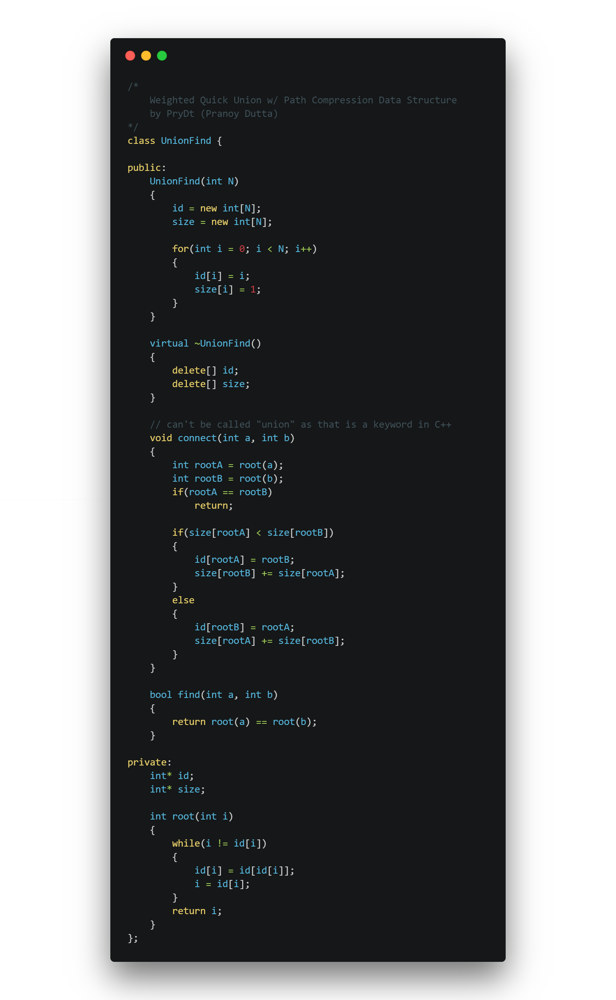

# Union Find (Dynamic Connectivity)
*AKA Disjointed-set Data Structure*

## What is a Union Find Data Structure?
A data structure that implements the following specs:

Given a set of `N` objects, implement two commands:
 - Union Command: connect two objects
 - Find / Connection Query: returns whether two objects are connected (can be connected through objects connected in common)

### Clarifications on Connections
 - Objects are connected to themselves (reflexive property)
 - Connections are two-way (symmetric property)
 - Connections can path through other objects and connections (as long as there is a path to the other object) (transitive property)

 ---

 NOTE: sets of connected objects are called connected components

 ---

## Applications of a Union Find Structure
 - Dynamic Connectivity in networks
 - Percolation Problems
 - Graph algorithms
 - and much more!

## Implementations
Moving on to implementations...

### Quick-Find (Eager Algorithm)
Quick Find will store the data of length N in a 1D array.
```CPlusPlus
id[N] // data
```

Every object will have an index in that array. We can find if two objects are connected by indexing into `id` and checking whether they have the same value.

*Fancy way of saying the above*:
`Objects A and B are connected iff they have the same id`

---

NOTE: `iff` means "if and only if", the jargon will be used throughout this website.

---

The `Find` method would literally be implemented as so:

```CPlusPlus
bool find(int a, int b)
{
	return id[a] == id[b]; // that's really it...
}
```

This extremely simple find gives this implementation its name; however there are downsides, and the downside here is the union method.

Union is extremely expensive for this implementation because once you connect two large connected components, you will have to replace every single `id` entry in one of the connected components which will take `O(n^2)` array accesses.

Union may be implemented like:

```CPlusPlus
void union(int a, int b)
{
	int idA = id[a];
	int idB = id[b];

	for(int i = 0; i < (sizeof(id) / sizeof(id[0])); i++)
	{
		if(id[i] == idA)
			id[i] = idB;
	}
}
```

A small improvement to this would be to decide which connected component is smaller and replace those objects, but it will *still* be too expensive (and will probably add overhead to the union method).

Remember... since the only two methods that the UnionFind object needs is union and find, they need to be efficient because they may be called a large number of times for large sets of data.

`O(n^2)` doesn't scale. As the problem size(`N`) gets larger, the algorithm will take more and more time in a quadratic manner.

### Quick-Find Wrap Up
Pros: fast `find()`, it is just in `O(1)` time
Cons: extremely slow `union()`

I've mentioned this enough, but quick-find just doesn't scale for large problems.

### Quick-Union (Lazy Approach)
Quick-Union stores all the data for each object with an array called `id`.

Here is where the differences in implementation start. `id` stores a "pointer" (in this case, an index in the same array) to a parent object, so `id` could be considered an array of trees.

---
Example: `id[0]` will return the index of the parent of the 0th object.
---

In the case that `id[0] == 0`, that just means that the 0th object's parent is itself.

A common term used in tree theory is a root. To the root of each tree, this would be the method used.

```CPlusPlus
int root(int i)
{
    while(i != id[i])
        i = id[i];
    return i;
}
```

The easiest way to find whether two objects are connect or not, is to check if their roots are equal or not.

```CPlusPlus
bool find(int a, int b)
{
    return root(a) == root(b);
}
```

Next up is a simple `union()` function:

```CPlusPlus
void union(int a, int b)
{
    id[root(a)] = root(b);
}
```

This implementation also has some glaring defects, which include:
 - Trees can become tall, making the tree structure devolve into a linked list like structure
 - `find()` now becomes too expensive in the worst case (being `O(N)`)

### Improvements to Quick-Union to make it viable
Weighting is an extremely effective method of improving Quick-Union. In weighting, we will keep track of the side of all of the connected components and when `union`-ing different components together, it will always put the smaller tree below the larger tree (linking the lower tree's root to the larger tree's root).

To keep track of components' sizes, we need a new array of side `N` called `size` (which will be initialized to all ones).

The `find()` will be the same as before, but `union()` needs to be slightly modified as such.
```CPlusPlus
void union(int a, int b)
{
    int rootA = root(a);
    int rootB = root(b);
    if(rootA == rootB)
        return;

    if(size[rootA] < size[rootB])
    {
        id[rootA] = rootB;
        size[rootB] += size[rootA];
    }
    else
    {
        id[rootB] = rootA;
        size[rootA] += size[rootB];
    }
}
```
This code is keeping track of the size of each component and will always change the smaller tree's root.

---
Math Stuff (you have been warned): with weighting, it has been proven that the depth (how far you have to traverse to get to the root of the tree) of any object cannot be greater than log2 of `N`. This makes the `find()` function much faster due to it being in (at worst case) `O(log2 N)` which is proportional to the depth of both objects being checked.
---

### Why does this work?

To understand why this works, we need to understand when would an object's depth increase. An object's depth will increase by 1 every time its root is `union`ed below another tree. This will only happened if the other tree has a number of objects equal to or more than the original tree. And *when* an object's depth increases by 1, that means that its tree has *at least* doubled in side, so at max, the size of a tree containing a depth of `d` can only double at most log2 `N` times.

### Another Easy Improvement - Path Compression

Path Compression shortens the depth of objects further. This is an improvement to the `root()` function.

Whenever root is calculated for a object, all path compression does, is go back down the root and set those objects' parent to the root.

```CPlusPlus
int root(int i)
{
    while(i != id[i])
    {
        id[i] = id[id[i]]; // just one line of changes, excluding curly braces
        i = id[i];
    }
    return i;
}
```

There is literally no reason not to add this simple improvement that basically keeps all the trees flat.

The Source Code my basic implementation of a weighted unionfind w/ path compression can be found [here](https://github.com/PryDt/algorithms/tree/master/union_find/UnionFind.h) and is shown below.


